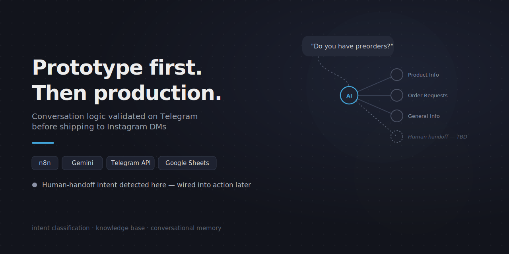
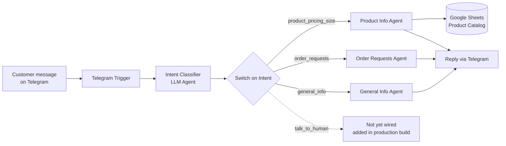
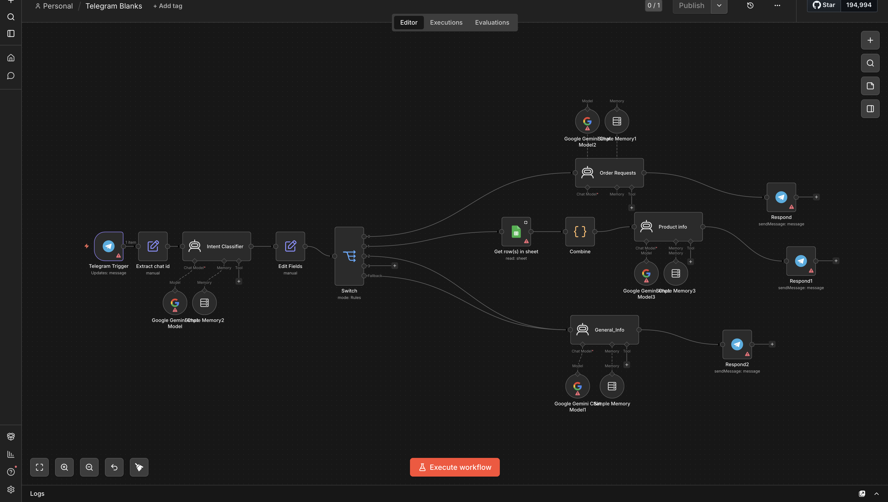

# Telegram Chatbot — Conversational Bot Prototype 

An early prototype of the **Instagram Brand** customer-service chatbot, built and validated on **Telegram** before being deployed to Instagram DMs via ManyChat. Same intent-classification core and knowledge base as [the production Instagram version](../she-and-co-instagram-chatbot) — this repo is the earlier build where the conversation logic was designed and tested against a simpler, direct messaging channel.

> This repo contains a **sanitized version** of a real prototype workflow. All credentials, spreadsheet IDs, return-portal URLs, and personal chat data have been removed or replaced with placeholders. See [Setup](#setup) to run your own copy.

## Why build it on Telegram first

Testing conversational logic directly against a platform like Instagram (via a third-party layer like ManyChat) adds a lot of moving parts — webhook relays, API rate limits, message-formatting quirks. Telegram's bot API is direct and fast to iterate against, which made it a better environment for the actual hard part of this project: getting intent classification, the product knowledge base, and multi-turn memory right *before* wiring it into a production messaging platform.

## How it works

1. **Telegram Trigger** receives an incoming message.
2. **Intent Classifier agent** reads the message and returns exactly one label: `general_info`, `order_requests`, `product_pricing_size`, or `talk_to_human` — instructed to output the label only, nothing else.
3. **A Switch node routes to the matching agent:**
   - **Product Info Agent** — reads live rows from a Google Sheet product catalog and answers only from matched product data (material, colors, sizing, "double layered" construction, etc.), tracking follow-up references like "it" or "the shirt" back to the last product discussed.
   - **Order Requests Agent** — handles order tracking, and returns/exchanges against a real eligibility policy (time-frame and condition checks) before sharing a returns portal link, rather than sharing it unconditionally.
   - **General Info Agent** — answers shipping questions from a fixed knowledge base (delivery times, restricted delivery areas, shipping costs by city), explicitly instructed not to volunteer shipping costs unless directly asked.
4. **Each agent keeps its own short-term memory buffer**, so follow-up questions in the same conversation stay coherent.
5. **Reply is sent back to the same Telegram chat.**

## What's different from the production version

This prototype predates the human-handoff feature that shipped in the Instagram production build: the `talk_to_human` intent is classified correctly here but isn't wired to an action yet — a clear marker of the point in development where "detect the intent" and "act on the intent" were being built as separate steps. The production Instagram/ManyChat version added the live Telegram team-alert handoff, order logging to Sheets, and size-chart lookup on top of this same core.

## Architecture

## Tech stack

| Layer | Tool |
|---|---|
| Orchestration | [n8n](https://n8n.io) (self-hosted workflow automation) |
| LLM / agents | Google Gemini via LangChain agent nodes |
| Messaging channel | Telegram Bot API |
| Data store | Google Sheets (product catalog) |
| Logic | n8n Set/Code nodes for intent normalization and data shaping |

## Setup

This workflow is built for [n8n](https://n8n.io) (Cloud or self-hosted).

1. Import [`workflows/telegram-instagram-brand-chatbot.json`](workflows/telegram-instagram-brand-chatbot.json) into your n8n instance (**Workflows → Import from File**).
2. Configure credentials for:
   - Telegram Bot API (create a bot via [@BotFather](https://t.me/BotFather))
   - Google Gemini (or any LLM supported by n8n's LangChain nodes)
   - Google Sheets OAuth
3. Update the `documentId` field in the Google Sheets node to point to your own product catalog sheet.
4. Update the knowledge-base text in the "Extract chat id" Set node and the Order Requests agent's return-policy link to match your own shipping/returns policy.
5. Activate the workflow.

## Screenshot

## Notes

- This is a sanitized export of a real prototype build — kept here specifically to show the iteration from proof-of-concept to production, alongside the [full Instagram/ManyChat version](../she-and-co-instagram-chatbot).
- Client name is anonymized here for confidentiality; happy to discuss specifics privately.
